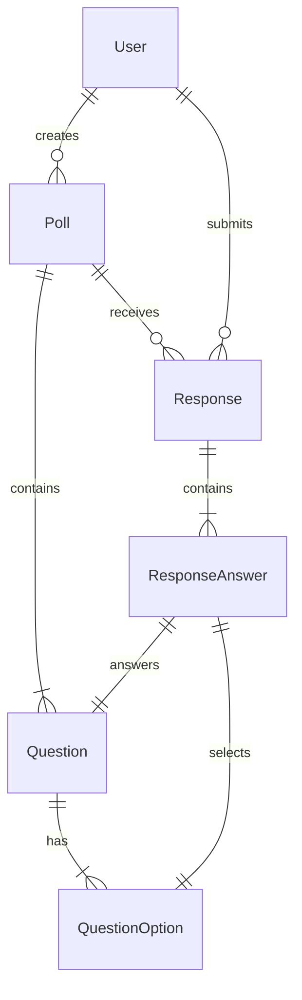

# PollStar — 投票 · HOSHI

A production-grade full-stack poll platform with an editorial Japanese-minimalist aesthetic. Built for clarity, speed, and real-time insights.

## Tech Stack

| Component | Technologies |
|---|-|
| **Frontend** | Vite, React, TypeScript, Tailwind CSS v3, TanStack Query, Zustand, Socket.io-client, Recharts, Lucide React |
| **Backend** | Node.js, Express, TypeScript, Prisma ORM (PostgreSQL), Zod, Socket.io, JWT, bcrypt, Resend (Email), Google OAuth |
| **Infrastructure**| Docker (optional), GitHub Actions (optional) |

## Database Schema



## Architecture Overview

- **Monorepo Structure**: Separate `client/` and `server/` folders for clean decoupling.
- **Real-time Engine**: Socket.io rooms scoped to individual polls for live response updates.
- **Security**: JWT access/refresh token rotation, hashed IP duplicate prevention for anonymous polls, and Zod schema validation on every endpoint.
- **Design System**: Editorial serif typography (Playfair Display) combined with clean geometric body text (DM Sans). High-contrast cream/charcoal/crimson palette.

## Setup Instructions

### Prerequisites
- Node.js 18+
- PostgreSQL database
- Resend API Key (for email verification)
- Google OAuth Client ID/Secret

### 1. Server Setup
```bash
cd server
cp .env.example .env
# Edit .env with your credentials
npm install
npx prisma db push
npm run dev
```

### 2. Client Setup
```bash
cd client
cp .env.example .env
# Edit .env (VITE_API_URL, VITE_SOCKET_URL)
npm install
npm run dev
```

## API Endpoints

| Method | Path | Auth | Description |
|---|---|---|---|
| POST | `/api/auth/register` | No | Create account & send verification email |
| POST | `/api/auth/login` | No | Authenticate & issue tokens |
| GET | `/api/polls/mine` | Yes | Get all polls for current user |
| POST | `/api/polls` | Yes | Create a new multi-question poll |
| GET | `/api/polls/:shareToken/public` | No | Get public poll data for participation |
| POST | `/api/responses/:shareToken` | No | Submit poll response |
| GET | `/api/analytics/:pollId` | Yes | Get detailed results & charts |

## Socket Events

| Event | Direction | Payload | Description |
|---|---|---|---|
| `join:poll` | Client -> Server | `pollId` | Join a specific poll's live room |
| `response:new` | Server -> Client | `{ totalResponses, questionUpdates }` | Triggered when a new response is submitted |
| `poll:published` | Server -> Client | `{ pollId }` | Triggered when results are made public |

---

Built with precision.
